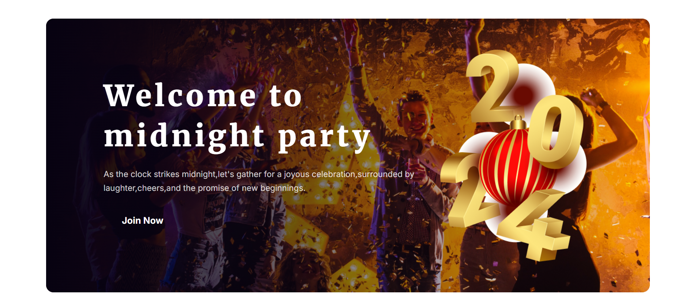

# 🎉 New Year 2024 Celebration – Landing Page

[🔗 Live Demo](https://devo-ab.github.io/new-year-celebration)

This is a **New Year 2024** celebration landing page where users can explore the event and **book their party**. Built using **HTML** and **CSS**, it’s fully responsive across all devices.

---

## ✨ Features

- 🎆 Greeting banner to welcome 2024
- 🎊 Discount offer details
- 🌃 Midnight party welcome section
- 📝 Detailed party information
- 🛍️ Holiday sale and New Year gift section
- 📬 Newsletter subscription
- 🦶 Footer with essential links/info
- ✅ Fully responsive layout for all devices
---

## 🛠️ Tech Stack

- **HTML5**
- **CSS3**
- **Responsive Design**

---

## 📁 Folder Structure

```
new-year-celebration/
├── assets/
│   ├── background/         # Background images
│   ├── icons/              # Icon assets
│   ├── images/             # General images used in the webpage
├── css/                    # Stylesheets (style.css)
├── preview/                # Screenshots for README
├── index.html              # Main landing page
└── README.md               # Project documentation
```

## 📸 Screenshots

### 🖼️ Banner Section


### 🖼️ Party Details


### 🖼️ Full Preview


---

## 🚀 Run Locally

To run this project on your machine:

```bash
git clone https://github.com/devo-ab/new-year-celebration.git
cd new-year-celebration
 ```

🌐 Deployment
This project is deployed using GitHub Pages.

Deploy in 3 steps:
Push the project to GitHub

Go to Settings > Pages

Select branch: main and folder: / (root) — then click Save

# 👤 Author

# Avi Jit

## :mailbox: Reach me out

<p align="left">
<a href="https://linkedin.com/in/itsavijitb" target="blank"></a>
<a href="https://twitter.com/itsavijitb" target="blank"></a>
<a href="https://facebook.com/itsavijitb" target="blank"></a>
<a href="https://instagram.com/itsavijitb" target="blank"></a>
</p>